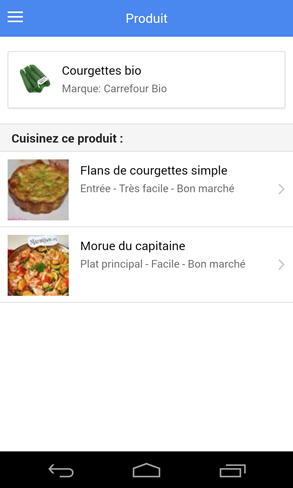
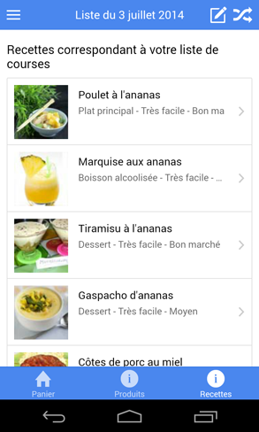

# Retail-scan app







[All screenshots](docs/screenshots)

This is a [ionic](http://ionicframework.com/) project for the retail-scan mobile application.  
It allows users to scan food products in stores and get meaningful and personalized recipes. Ingredients can be saved in a grocery list for a convenient shopping.

## Setup

This project require several tools, if they are not installed, please do.

- [nodejs](http://nodejs.org/) and npm
- [bower](http://bower.io/) : ```npm install -g bower``` (probably with sudo)
- [grunt](http://gruntjs.com/getting-started) : ```npm install -g grunt-cli``` (probably with sudo)
- [cordova](https://cordova.apache.org/) : ```npm install -g cordova``` (probably with sudo)
- [ionic](http://ionicframework.com/) : ```npm install -g ionic``` (probably with sudo)
- targeted mobile development environment : [XCode](https://developer.apple.com/xcode/), [Android SDK](http://developer.android.com/sdk/index.html) or [Windows Phone SDK](http://developer.windowsphone.com/en-us)

## Getting started

Here are the few steps to get things working :

- `npm install` to install all grunt dependencies
- `bower install` to install all bower dependencies
- You are ready !!!! \o/

To run the app, you have many ways :

- In desktop browser :
    - `grunt serve` to test on your computer
- In your android device :
    - `mkdir platforms plugins` create folders platforms plugins www (essential for cordova)
    - `cordova platform add android` add android platform to the project
    - `cordova plugin add org.apache.cordova.device org.apache.cordova.console org.apache.cordova.statusbar org.apache.cordova.geolocation https://github.com/wildabeast/BarcodeScanner.git`
    - `ionic run android` to run app on your phone

## Todo

See [trello board](https://trello.com/b/fdodl9nl/retail-scan)

## Incoming features

- get geoloc on scans
- associate recipes with ingredients (in ingredients details)
- most common ingredients in ingredient grid
- breadcumbs on ingredient grid
- details on products (with notes and nutrtion)
- add multi cart (change and create carts)

## Infos

- Installed platforms :
    - android (```ionic platform add android```)
- Installed plugins :
    - device (```cordova plugin add org.apache.cordova.device```)
    - console (```cordova plugin add org.apache.cordova.console```)
    - statusbar (```cordova plugin add org.apache.cordova.statusbar```)
    - [barcodescanner](https://github.com/wildabeast/BarcodeScanner) (```cordova plugin add https://github.com/wildabeast/BarcodeScanner.git```)
    - [geolocation](https://cordova.apache.org/docs/en/3.0.0/cordova_geolocation_geolocation.md.html) (```cordova plugin add https://git-wip-us.apache.org/repos/asf/cordova-plugin-geolocation.git```)

## Technos

- Mobile : Look at [ratchet](http://goratchet.com/)
- Back end : [Play/Scala](http://www.playframework.com/) vs [RESTX](http://restx.io/) vs [dropwizard](https://dropwizard.github.io/dropwizard/)
- API docs : [apiary](http://apiary.io/) vs [daux.io](http://daux.io/) vs [flatdoc](http://ricostacruz.com/flatdoc/)
