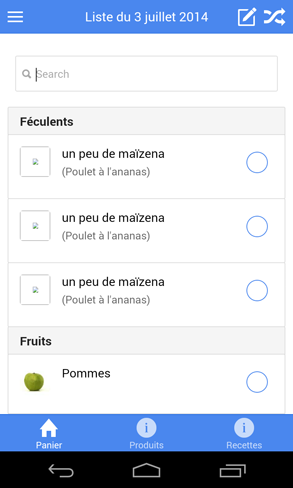

# Retail-scan app





[All screenshots](docs/screenshots)

This is a [ionic](http://ionicframework.com/) project for the retail-scan mobile application.  
It allows users to scan food products in stores and get meaningful and personalized recipes. Ingredients can be saved in a grocery list for a convenient shopping.

## Setup

This project require several tools, if they are not installed, please do.

- [nodejs v0.10.26](http://nodejs.org/) and npm (`node -v`)
- [bower 1.3.3](http://bower.io/) : `sudo npm install -g bower` (`bower -v`)
- [grunt v0.1.13](http://gruntjs.com/getting-started) : `sudo npm install -g grunt-cli` (`grunt -v`)
- [cordova 3.4.1-0.1.0](https://cordova.apache.org/) : `sudo npm install -g cordova` (`cordova -version`)
- targeted mobile development environment : [XCode](https://developer.apple.com/xcode/), [Android SDK](http://developer.android.com/sdk/index.html) or [Windows Phone SDK](http://developer.windowsphone.com/en-us)

Other libs :

- [ionic 1.0.0-beta.4](http://ionicframework.com/) : installed via bower
- Cordova plugins : [BarcodeScanner](https://github.com/wildabeast/BarcodeScanner), [device](https://github.com/apache/cordova-plugin-device/blob/master/doc/index.md)

## Getting started

Here are the few steps to get things working :

- `npm install` to install all grunt dependencies
- `bower install` to install all bower dependencies
- You are ready !!!! \o/

To run the app, you have many ways :

- In desktop browser :
    - `grunt serve` to test on your computer
- In your android device :
    - `mkdir platforms plugins www` create folders platforms plugins www (essential for cordova)
    - `cordova platform add android` add android platform to the project
    - `cordova plugin add org.apache.cordova.device cordova plugin add https://github.com/wildabeast/BarcodeScanner.git`
    - `grunt build && cordova run android` to run app on your phone

# Grunt commands

- `grunt serve` use it to develop. It will open your project in browser with live realod.
- `grunt ripple` is an alternative to `grunt serve`. It will open your project in adobe ripple editor with live realod.
- `grunt build` builds your sources and put them in www/ folder to deploy on your device.

## Todo

- ingredientDetails : improve design !!! (show picture, name, category & price info / put field "notes" at the end)
- add price data for ingredients (for recipe estimates...)
- ingredientSearch : don't show ingredients already in list, set max elements to 17, filter only on name, order by popularity

- back button problems : often go back to home !!!
- parse search input to get quantity & quantityUnit
- typer les champ de texte pour que le clavier ne commence pas par une majuscule...
- ajouter la liste des unités possibles
- remove search text when add ingredient but keep focus
- add a clear search button when it has some text
- save ingredients, ingredient categories & units on localstorage to allow users to add & customize them (and sync with API)
- allow to change ingredient category (in ingredientDetails)
- allow to create & organize ingredient categories
- for unknown ingredient, allow to change name & picture (in addition on category)
  
- filtres sur les photos de recette (oeil de poisson)
- liste de course
    - masquer les produits achetés (les afficher en cliquant sur le bandeau "Produits achetés")
- Other : see [trello board](https://trello.com/b/fdodl9nl/retail-scan)

## Bugs

- screen blink on phone :(
- when you scroll on a modal, the view behind also scrolls !!! (see add ingredient in recipe section)

## Incoming features

- get geoloc on scans
- associate recipes with ingredients (in ingredients details)
- most common ingredients in ingredient grid
- breadcumbs on ingredient grid
- details on products (with notes and nutrtion)
- add multi cart (change and create carts)

## Infos

- Installed platforms :
    - android (```ionic platform add android```)
- Installed plugins :
    - device (```cordova plugin add org.apache.cordova.device```)
    - console (```cordova plugin add org.apache.cordova.console```)
    - statusbar (```cordova plugin add org.apache.cordova.statusbar```)
    - [barcodescanner](https://github.com/wildabeast/BarcodeScanner) (```cordova plugin add https://github.com/wildabeast/BarcodeScanner.git```)
    - [geolocation](https://cordova.apache.org/docs/en/3.0.0/cordova_geolocation_geolocation.md.html) (```cordova plugin add https://git-wip-us.apache.org/repos/asf/cordova-plugin-geolocation.git```)

## Technos

- Take a look at https://crosswalk-project.org/
- Take a look at https://parse.com/
- Mobile : Look at [ratchet](http://goratchet.com/)
- Back end : [Play/Scala](http://www.playframework.com/) vs [RESTX](http://restx.io/) vs [dropwizard](https://dropwizard.github.io/dropwizard/)
- API docs : [apiary](http://apiary.io/) vs [daux.io](http://daux.io/) vs [flatdoc](http://ricostacruz.com/flatdoc/)